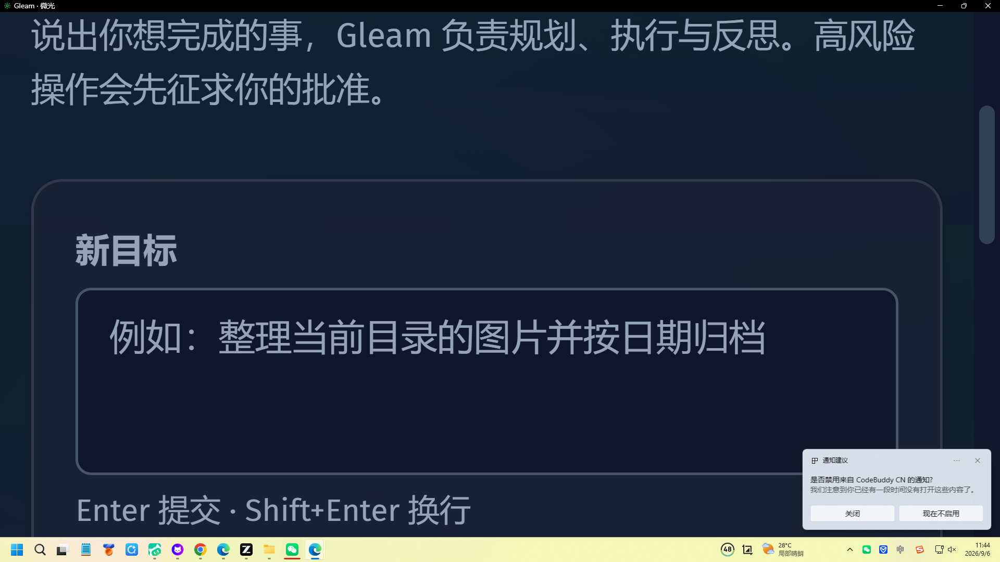
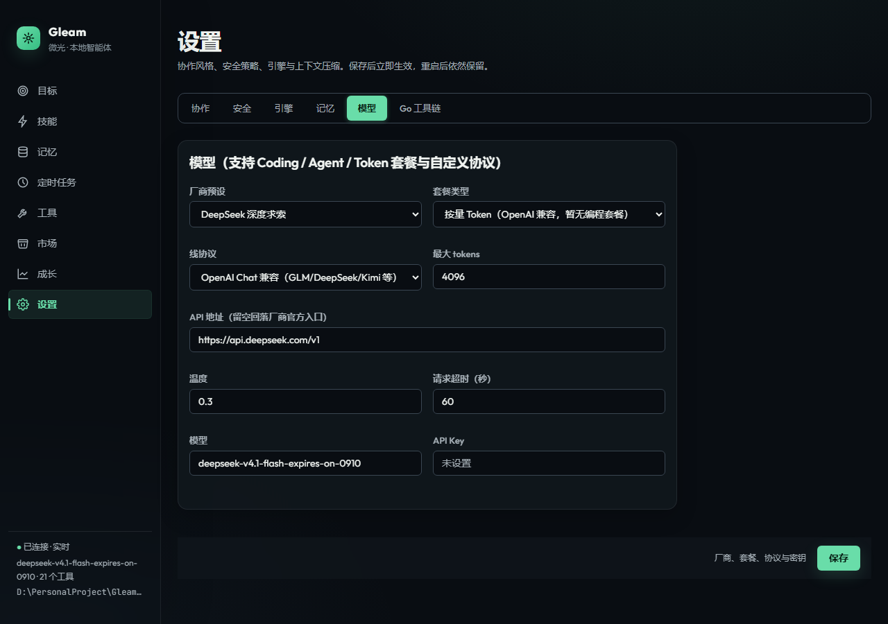
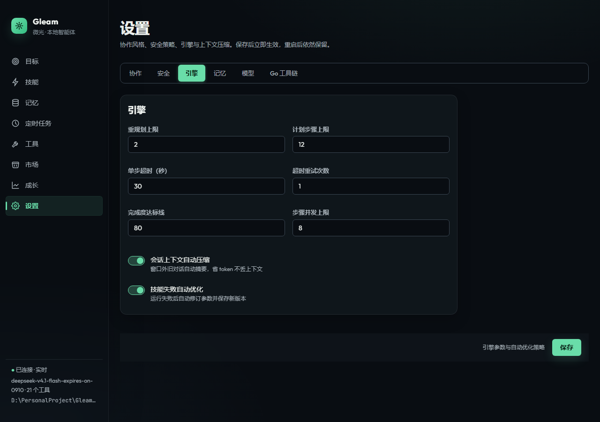

# Gleam（微光）

**言語:** [English](README.md) | [简体中文](README.zh-CN.md) | 日本語

**ローカルファーストなデスクトップ AI エージェント——仕事を見据え、あなたに寄り添う。**

<p align="center">
  <a href="https://github.com/gleam-ai/Gleam/releases"></a>
  <a href="https://github.com/gleam-ai/Gleam/stargazers"></a>
  <a href="https://github.com/gleam-ai/Gleam/blob/master/LICENSE"></a>
  <a href="https://go.dev/"></a>
  <a href="https://github.com/gleam-ai/Gleam/actions"></a>
</p>

<p align="center">
  決断はあなたが。実行は Gleam が。
</p>

Gleam は単なるチャットボットでも、単純なタスク実行器でもありません。**記憶と判断を持ち、仕事を前に進められる**デスクトップエージェントです。Go でゼロから自作し、**サードパーティの Go 依存はゼロ**、単一バイナリ約 **10MB** です。

**ローカルファースト**とは、会話・記憶・タスク状態・監査ログが既定で本機に残ることを指します。**オフライン LLM ではありません**：実モデル接続時は設定したベンダー API へ送信します。Mock モードならネットワークなしで体験できます。詳細は[ローカルファーストの正直な説明](#ローカルファーストの正直な説明)を参照してください。

---

## プレビュー

<p align="center">
  
</p>

<p align="center">
  
  
</p>

---

## Star 推移

<p align="center">
  <a href="https://star-history.com/#gleam-ai/Gleam&Date">
    
  </a>
</p>

---

## 製品概要

| 項目 | 内容 |
| :--- | :--- |
| **できること** | ファイル整理・タスク計画・定期実行・ツール駆動の自動化向けローカルファーストなデスクトップエージェント |
| **ではないもの** | ホスト型 SaaS チャット、クラウド RAG 基盤、完全オフライン LLM |
| **バイナリ** | 単一ファイル約 10MB、純 Go（cgo なし）、マルチプラットフォーム向けクロスビルド |
| **拡張** | 組み込みツール 23 種 + MCP による外部ツールのホットプラグ |
| **インターフェース** | デスクトップ、CLI（`goal` / `doctor` など）、Web UI、stdio 上の JSON-RPC（エディタプラグイン） |

---

## 機能

### 自律タスクエンジン

Plan → Execute → Reflect のループ。DAG 依存の並列実行、0–100 の完了度スコア、低スコア時の自動再計画。

### 3 つのタスクモード

| モード | 用途 |
| :--- | :--- |
| **対話** | LLM への直接 Q&A（計画/実行ループなし） |
| **作業** | Plan-Execute-Reflect のフルパイプライン |
| **コーディング** | 最小 diff + ビルド検証 |

### 3 層メモリ

- **短期:** 直近約 20 ターンの会話バッファ
- **作業:** タスク結果をディスク保存しセッション横断で再利用
- **長期:** 自作の語彙インデックス（中国語バイグラム + FNV + コサイン）、JSON 永続化、外部ベクトル DB なし

### 安全ゲート

モード `auto` / `plan_first` / `interactive`。ツールごとの権限（読み取り専用 / 承認必要 / フルアクセス）。高リスク操作は計画提示のうえ確認待ち。監査はディスクに全量保存。

### モデル接続

9 ベンダーの公式入口プリセット（智譜 GLM / DeepSeek / Kimi / 通義 / 火山方舟 / MiniMax / OpenAI / Anthropic / OpenRouter）。トークン従量 / Coding / Agent などの形態に対応。

### スキル・ペルソナほか

- **スキル:** 実行 → 固化 → 再利用、YAML バージョン管理、成功率トラッキング
- **ペルソナ:** 7 つのシーンテンプレート（汎用 / 分析 / 制作 / 開発 / PM / 研究 / 運用）
- コンテキスト圧縮、目標モードの進捗配信、MCP + スキル市場フック
- GEO 評価、成長ログ、コスト看板、タスク予算、ループ検出
- 変更一覧と書き込み前リストア；送信記録（ホスト名とバイト数のみ、本文は記録しない）

---

## アーキテクチャ（概要）

```
cmd/gleam/              エントリ（app / serve / goal / webui / eval / doctor …）
internal/
  agent/                自律エンジン: planner → executor → reflector
  harness/
    registry/           ツール登録（ホット登録 / 置換 / 解除）
    memory/             3 層メモリ + コンテキスト圧縮
    safety/             安全ゲート + 監査ログ
    scheduler/          Cron・間隔・ファイル監視・HTTP コールバック
    skill/              スキル固化 / 版管理 / 再利用
  tools/                ファイル / shell / web / デスクトップ / MCP クライアント
  llm/                  OpenAI Chat · Responses · Anthropic Messages（SSE）
  server/               JSON-RPC 2.0 over stdio
  webui/                HTTP REST + SSE + 埋め込みフロント
  eval/                 プロンプト / 行動リグレッション評価
pkg/types/              横断型
```

**スタック:** Go 1.22+（`go.mod` は標準ライブラリのみ）、JSON-RPC（stdio）と HTTP REST + SSE、`go:embed` 埋め込み SPA、自作 YAML サブセットとホットリロード設定オーバーレイ。

---

## プラットフォーム

| プラットフォーム | 現状 |
| :--- | :--- |
| **Windows** | デスクトップが主：トレイ常駐、単一インスタンス、埋め込みウィンドウ（`gleam app` / Desktop パッケージ） |
| **macOS / Linux** | 当面はブラウザ / サービス中心：トレイ未実装時は `gleam app` が既定ブラウザを開く；`gleam webui` でサービスのみも可 |

バイナリは未コードサイン・未 Apple 公証です。初回は Windows SmartScreen や macOS Gatekeeper に止められることがあります。[サイトのダウンロード案内](http://gleam.wangjn.top/#download)に従い実行許可または隔離属性解除（`xattr`）をしてください。

---

## インストールと実行

### ダウンロード

[Releases](https://github.com/gleam-ai/Gleam/releases) から各プラットフォーム用バイナリを入手してください。

### 実行

```bash
# デスクトップ（Windows 推奨）
./gleam app

# オフライン体験可能な Mock（API キー不要）
./gleam goal "カレントに hello.txt を作成" --mock-llm

# 実モデル（設定した API へ送信）
export GLEAM_API_KEY=your_api_key
./gleam goal "ここにある Markdown を列挙して要約" --mode auto

# Web UI のみ
./gleam webui
```

### ソースからビルド

```bash
go build -trimpath -ldflags="-s -w" -o bin/gleam ./cmd/gleam
bash scripts/build-desktop.sh   # マルチプラットフォーム向けクロスビルド
```

Windows 向け: `scripts/install.ps1`。

---

## ツールと MCP

**組み込みツール 23 種**の例:

| グループ | ツール |
| :--- | :--- |
| ファイル | `file.list` `file.read` `file.write` `file.mkdir` `file.move` `file.delete` `file.search` |
| Shell | `shell.exec` |
| Web | `web.fetch` |
| デスクトップ | `desktop.clipboard.read` `desktop.clipboard.write` `desktop.screenshot` `desktop.notify` `desktop.snippets` |
| メモリ | `memory.save` `memory.search` `memory.delete` |
| スケジュール | `schedule.create` `schedule.list` `schedule.delete` |
| スキル | `skill.list` `skill.run` |
| 返信 | `reply` |

**MCP:** 設定の `mcp:` に外部サーバ（command + args + trust）を宣言。起動時に同一レジストリへ登録されます。

---

## 設定とデータディレクトリ

| パス | 役割 |
| :--- | :--- |
| `configs/config.yaml` | サンプル / 同梱設定（YAML サブセット、インデント 2 スペース） |
| `~/.gleam/` | 既定の**データディレクトリ**（`--data-dir` で上書き可） |
| `~/.gleam/settings.yaml` | 本機設定オーバーレイ（保存で即時反映） |
| `~/.gleam/memory/` `tasks/` `skills/` | 長期メモリ、タスクアーカイブ、スキル |
| `~/.gleam/schedules.json` | スケジューラ状態 |
| `~/.gleam/audit.jsonl` | 安全 / 送信監査 |
| `~/.gleam/browser-profile/` | デスクトップ埋め込みブラウザプロファイル |

API キーは YAML に書かず、環境変数 `GLEAM_API_KEY` で渡すことを推奨します。

---

## ローカルファーストの正直な説明

**ローカルファースト ≠ オフライン LLM。**

- 会話・記憶・タスク状態・スキル・監査は既定で**本機**に残ります。
- **Mock**（`--mock-llm` / `provider: mock`）はクラウドモデルなしでエージェントフローを体験できます。
- **実モデル**は設定した **API** にプロンプトを送ります。送信ログはホスト名とバイト数のみで、本文は記録しません。
- 任意のクラウドログイン / フィードバック経路も同様に送信し、監査されます。

既知の制限と意図的にやらないこと: [docs/known-limits.md](docs/known-limits.md)。

---

## ドキュメント

| 文書 | 内容 |
| :--- | :--- |
| [既知の制限とやらないこと](docs/known-limits.md) | **公開の単一ソース**: 制限 / 却下案 / 意図的非目標 |
| [コントリビューション](CONTRIBUTING.md) | ローカル開発、コミット規約、組織ガイド入口 |
| [セキュリティ](SECURITY.md) | 脆弱性報告とローカルファーストの境界 |
| [CHANGELOG](pack/CHANGELOG.md) | 変更履歴 |

---

## コントリビューションとセキュリティ

- PR の前に [CONTRIBUTING.md](CONTRIBUTING.md) を読んでください（Conventional Commits、署名コミット、DCO 風 sign-off）。
- 脆弱性は [SECURITY.md](SECURITY.md) に従って報告してください。秘密経路が必要な場合は公開 Issue を使わないでください。
- 組織ポリシー: [gleam-ai/.github](https://github.com/gleam-ai/.github)。

---

## ライセンス

[MIT License](LICENSE)

> Gleam は「より人間らしい AI」ではなく、「より信頼できる同僚」を目指します。
