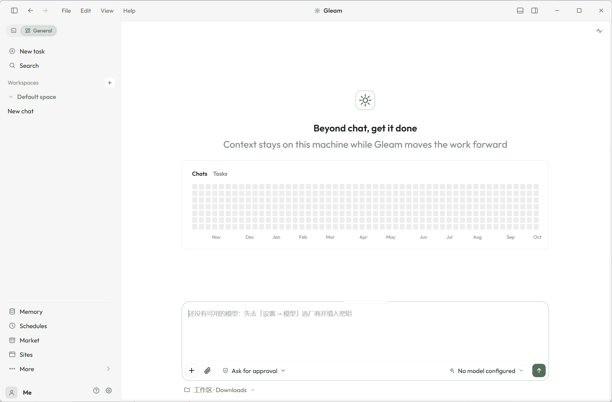
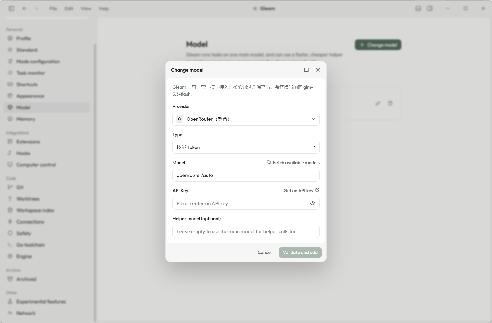
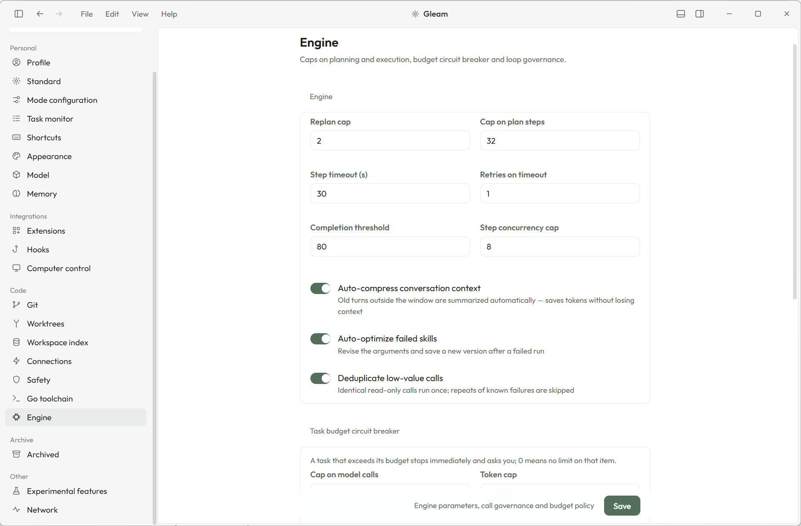

# Gleam（微光）

其他语言：[简体中文](README.md) · [English](README.en.md) · [日本語](README.ja.md)

**本地优先的桌面 AI 智能体——眼里有活，心里有你。**

<p align="center">
  <a href="https://github.com/gleam-ai/Gleam/releases"></a>
  <a href="https://github.com/gleam-ai/Gleam/stargazers"></a>
  <a href="https://github.com/gleam-ai/Gleam/blob/master/LICENSE"></a>
  <a href="https://go.dev/"></a>
  <a href="https://github.com/gleam-ai/Gleam/actions"></a>
</p>

<p align="center">
  你负责做决定，具体执行交给我。
</p>

Gleam 不是聊天机器人，也不是任务执行器，而是一个**有记忆、有判断、能主动推进工作**的桌面智能体。核心基于 Go 从零自研，**零第三方 Go 依赖**，单文件二进制约 **10MB**；桌面外壳用 Electron，把这份内核包成一个**双击即用**的安装包。

**本地优先**指对话、记忆、任务状态与审计默认落在本机。这**不等于**离线大模型：接入真实 LLM 时仍会向你配置的厂商 API 出网；Mock 模式可不联网体验。详见下方[关于「本地优先」](#关于本地优先)。

---

## 预览

<p align="center">
  
</p>

<p align="center">
  
  
</p>

---

## Star 趋势

<p align="center">
  <a href="https://star-history.com/#gleam-ai/Gleam&Date">
    
  </a>
</p>

---

## 产品概览

| 主题 | 说明 |
| :--- | :--- |
| **是什么** | 本地优先的桌面 AI 智能体：文件整理、任务规划、定时执行与工具驱动自动化 |
| **不是什么** | 托管 SaaS 聊天产品、云端 RAG 平台，或「完全离线大模型」 |
| **内核** | 单文件 ~10MB，纯 Go（无 cgo），多平台交叉编译 |
| **桌面端** | Electron 外壳 + 本机内核；Windows 提供辅助安装包，内置 Node / uv，**装完即用，无需手动配环境** |
| **扩展** | 内置 27 种工具 + MCP 热插拔外部工具 |
| **接入面** | 桌面端、CLI（`goal` / `doctor` 等）、Web UI、JSON-RPC over stdio（编辑器插件） |

---

## 核心功能

### 自主任务引擎

Plan → Execute → Reflect 三阶段循环，DAG 依赖并发执行，0–100 完成度评分，低分自动重规划。

### 三种任务模式

| 模式 | 场景 |
| :--- | :--- |
| **对话** | 直连 LLM 快速问答，不经规划/执行 |
| **工作** | 全流程 Plan-Execute-Reflect |
| **编程** | 最小 diff + 构建验证 |

### 三层记忆与上下文窗口

- **短期**：最近若干轮对话缓冲；**工作**：任务结果落盘，跨会话可用；**长期**：自研词法索引（中文双字组 + FNV + 余弦），JSON 持久化，无第三方向量库。
- **上下文窗口**：窗口大小按内置模型表识别（认不出按 128k，也可手填或用 200K / 400K / 1M 档位），占用按**最近一次请求的真实 prompt tokens** 计算。
- **自动压缩**：任务已结束时到 **90%** 开始压缩，任务还在跑时到 **96%** 才动手，压完继续把任务做完；溢出窗口的旧对话随时汇总成摘要，不会丢。

### 任务隔离（Git Worktrees）

开启后每个任务在自己的 worktree 副本里执行，主工作区全程不动，改动留在任务分支上。任务跑完自动清掉**没有未提交改动**的副本；有改动的一律保留。关着时任务直接在工作区里执行。

### 安全门控

三种安全模式（`auto` / `plan_first` / `interactive`），每个工具可独立设置只读放行 / 需批准 / 完全访问，高风险操作执行前展示计划请求确认，全量审计落盘。改动清单与写前还原；出网留痕（只记主机名与字节量，绝不记内容）。

### 模型接入

9 家厂商官方入口预设（智谱 GLM / DeepSeek / Kimi / 通义 / 火山方舟 / MiniMax / OpenAI / Anthropic / OpenRouter），支持 Token 按量 / Coding 编程 / Agent 智能体等套餐形态一键切换，主模型之外可另配一个更快的**辅助模型**。

### 技能、角色与更多

- **技能系统**：执行 → 固化 → 一键复用，YAML 版本化，成功率统计
- **专家角色**：7 个预置场景模板（通用 / 数据分析师 / 内容创作者 / 开发工程师 / 项目经理 / 研究员 / 运维专家）
- 目标模式实时进度、MCP + 技能市场入口、GEO 生成式引擎优化评估、成长日志、消耗看板、任务预算熔断、防打转检测
- 界面中英双语（跟在设置里切换；**后端返回的任务进度、通知与报错保持原文**）

---

## 架构（简述）

```
cmd/gleam/              主入口（app / serve / goal / webui / desktop-sidecar ...）
internal/
  agent/                自主任务引擎：planner → executor → reflector
  worktree/             每个任务的 git worktree 生命周期
  harness/
    registry/           工具注册表（热注册/替换/注销）
    memory/             三层记忆 + 上下文自动压缩
    safety/             安全门控 + 全量审计落盘
    scheduler/          Cron + 固定间隔 + 文件监听 + HTTP 回调
    skill/              技能固化/版本化/复用
  tools/                文件 / shell / web / git / 桌面集成 / MCP 客户端
  llm/                  三协议客户端（OpenAI Chat / Responses / Anthropic）
  server/               JSON-RPC 2.0 over stdio
  webui/                HTTP REST + SSE + 内嵌前端（中英双语）
  eval/                 提示词与行为回归评测
pkg/types/              跨层类型
desktop/                Electron 桌面外壳（主进程 / preload / 打包配置）
```

**技术栈要点：** Go 1.22+，`go.mod` 仅标准库；JSON-RPC（stdio）与 HTTP REST + SSE；`go:embed` 内嵌前端；自研 YAML 子集解析，设置覆盖层保存即热生效。桌面外壳用 Electron（`asar`，页面跑在沙箱里，经 `app://` 代理访问回环服务）。

---

## 平台说明

| 平台 | 当前形态 |
| :--- | :--- |
| **Windows** | **桌面安装包为主**：NSIS 辅助安装（可选「所有人 / 仅我」、可改目录、完成页可勾选直接运行、自动建桌面与开始菜单快捷方式），内置 Node 与 uv，装完即用。安装界面语言**按电脑区域自动选**：中国区域显示中文，其它区域显示英文。 |
| **macOS / Linux** | 暂以浏览器 / 服务模式为主：`gleam app` 在无托盘实现时回退为打开系统默认浏览器；也可用 `gleam webui` 只起服务。macOS 桌面外壳目前只到解包目录，没有 dmg。 |

二进制尚未做代码签名与 Apple 公证。Windows 上 SmartScreen 会拦一次（安装器与二进制都会），macOS 上 Gatekeeper 会拦——按官网[下载区](http://gleam.wangjn.top/#download)说明放行或清除隔离属性（`xattr`）。

---

## 1.1.1 新增

- **Windows 桌面安装包**：Electron 外壳 + NSIS 辅助安装，自动建快捷方式，装完直接可用；内置 Node（含 npx）与 uv（含 uvx），**运行期只进 Gleam 自己的进程树 PATH，不动系统 PATH**。
- **首启「环境准备中」**：真探测（`node -v` / `uv --version` / `git --version`），不排假动画、也不拦路；这一屏的语言跟着系统区域走。
- **上下文窗口与自动压缩**：输入区显示窗口占用读数，到 90%（任务已结束）/ 96%（任务进行中）自动收紧下一轮携带的对话，压完继续把任务做完。
- **任务隔离（Worktrees）**：每个任务在自己的副本目录里跑，改动留在任务分支上，绝不静默并回主工作区。
- **Git 三件套**：`git.branch` / `git.commit` / `git.push` 走安全门控（推送每次都要你批准）。
- **应用菜单栏**：文件 / 编辑 / 视图 / 帮助，悬停切换、键盘可操作；桌面端经 preload IPC 落到真实窗口动作，浏览器里自动隐藏做不到的项。
- **终端面板**（Ctrl+J）与**右侧栏**（Ctrl+Shift+B）：工作区文件、内置浏览器、终端入口。
- **问题反馈**（Ctrl+Alt+F）：可附截图，先存本机，配置了远端才上送。
- **可编辑快捷键**：搜索、录制、冲突检测、一键恢复默认。
- **设置 v2**：整页分组导航；模型页可添加 / 编辑模型并做真实连通校验，密钥从不回显；SSH 主机从 `~/.ssh/config` 只读取 Host 名称；已归档任务可删除；网络页做连接检测并显示代理来源。

---

## 安全：本地 API 口令

- Web UI 只监听回环地址（默认 `127.0.0.1`），并校验 Host / Origin。
- 每次启动生成一枚 API 口令，写入 `~/.gleam/webui.token`（权限 0600）。所有接口请求都要在 `X-Gleam-Token` 头里带上它；应用内界面会自动携带。
- 脚本或 CI 调用（例如钩子 `POST /api/hooks/{name}`）时读取该文件：

  ```bash
  curl -H "X-Gleam-Token: $(cat ~/.gleam/webui.token)" -X POST http://127.0.0.1:8787/api/hooks/{name}
  ```
- 需要固定口令时可用环境变量 `GLEAM_WEBUI_TOKEN` 预置。不要把端口暴露到局域网或公网。
- API Key 保存在本机凭证存储，只发往你配置的接入主机；界面只显示「已设置 / 未设置」。

---

## 安装与运行

### Windows：下载安装包（推荐）

前往 [Releases](https://github.com/gleam-ai/Gleam/releases) 下载 `Gleam Setup <版本>.exe`，双击走完四步即可，**不需要自己装 Node、uv 或其它运行时**。安装界面按电脑区域显示中文或英文。

只想用命令行内核、不要桌面外壳，就下载单文件二进制：

```bash
./gleam app                                # 桌面端窗口
./gleam goal "在当前目录创建 hello.txt" --mock-llm   # 离线体验，不需要 API Key
./gleam webui                              # 只起 Web UI
```

### 接入真实模型

```bash
export GLEAM_API_KEY=你的APIKey
./gleam goal "列出当前目录的 Markdown 文件并总结" --mode auto
```

### 从源码构建

```bash
# 内核（单文件二进制）
go build -trimpath -ldflags="-s -w" -o bin/gleam ./cmd/gleam

# 桌面安装包（Windows；需要 Node 20+）
cd desktop
npm ci
npm run pack:win      # -> <系统临时目录>/gleam-pack/Gleam-Setup.exe
```

内核的多平台交叉编译见 `scripts/build-desktop.sh`；Windows 上的辅助安装脚本是 `scripts/install.ps1`。桌面外壳的工程说明见 [`desktop/README.md`](desktop/README.md)。

---

## 工具与 MCP

**内置 27 种工具**，包括：

| 分组 | 工具 |
| :--- | :--- |
| 文件 | `file.list` `file.read` `file.write` `file.mkdir` `file.move` `file.delete` `file.search` |
| Shell | `shell.exec` |
| Web | `web.fetch` |
| Git | `git.branch` `git.commit` `git.push` |
| 桌面 | `desktop.clipboard.read` `desktop.clipboard.write` `desktop.screenshot` `desktop.notify` `desktop.snippets` |
| 记忆 | `memory.save` `memory.search` `memory.delete` |
| 调度 | `schedule.create` `schedule.list` `schedule.delete` |
| 技能 | `skill.list` `skill.run` |
| 提示词 | `prompt.run` |
| 回复 | `reply` |

**MCP：** 在配置的 `mcp:` 下声明外部服务器（command + args + trust）。启动时注册进同一工具表；也可以在应用内的市场里一键安装（走内置的 npx / uvx）。

---

## 配置与数据目录

| 路径 | 作用 |
| :--- | :--- |
| `configs/config.yaml` | 示例 / 随仓库提供的配置（YAML 子集，2 空格缩进） |
| `~/.gleam/` | 默认**数据目录**（可用 `--data-dir` 覆盖） |
| `~/.gleam/settings.yaml` | 本机设置覆盖层（保存即热生效） |
| `~/.gleam/memory/` `tasks/` `skills/` | 长期记忆、任务归档、技能 |
| `~/.gleam/worktrees/` | 任务副本（启用 worktree 隔离时）及其元数据 |
| `~/.gleam/schedules.json` | 调度状态 |
| `~/.gleam/audit.jsonl` | 安全 / 出网审计 |
| `~/.gleam/browser-profile/` | 桌面端内嵌浏览器配置 |
| `~/.gleam/webui.token` | 每次启动生成的 Web UI API 口令（0600）。所有 Web UI API 请求都要在 `X-Gleam-Token` 头里带上它，应用内界面会自动携带；可用 `GLEAM_WEBUI_TOKEN` 预置 |

API Key 建议用环境变量 `GLEAM_API_KEY` 注入，不要写入并提交 YAML。

---
---

## Web UI 接口清单

Web UI 的 REST 接口与代码里注册的路由一一对应；清单与实现不一致会被 `scripts/check-api-docs.py` 拦下。所有接口都要带 `X-Gleam-Token`（见上一节）。

| Endpoint | Purpose |
| :--- | :--- |
| `GET /api/info` | 应用版本、平台与运行形态；界面从这里取版本号，不抄字面量 |
| `POST /api/heartbeat` · `POST /api/show-window` | 本机存活心跳 / 把窗口拉到前台 |
| `GET /api/settings` · `POST /api/settings` | 读写设置覆盖层（保存即热生效） |
| `GET /api/onboarding` · `POST /api/onboarding` | 首次引导的状态与提交 |
| `GET /api/providers` | 厂商预设清单（官方入口 × 套餐形态） |
| `POST /api/llm/models` · `POST /api/llm/test` | 拉取厂商模型列表 / 按表单当前值做一次最小连通测试 |
| `GET /api/models` · `POST /api/models` · `PUT /api/models/{id}` · `DELETE /api/models/{id}` · `POST /api/models/{id}/default` · `POST /api/models/{id}/activate` | 多模型管理：列出 / 新增 / 修改 / 删除，切换默认模型与启用状态 |
| `GET /api/account` · `POST /api/account/configure` · `POST /api/account/signup` · `POST /api/account/signin` · `POST /api/account/signout` · `POST /api/account/oauth` | 云端账号：状态、配置项目连接、注册 / 登录 / 退出 / OAuth |
| `GET /api/local-data` | 本机数据目录的规模与构成 |
| `GET /api/network` · `GET /api/connections` | 网络连接检测 / 出网与连接的常驻边界台账 |
| `GET /api/security/audit` | 安全门控留痕（拦截 / 放行 / 审核模型加拦） |
| `GET /api/workspace` · `POST /api/workspace` · `POST /api/workspace/clear` | 读 / 切换工作区、已打开的工作区列表与清空 |
| `GET /api/fs` | 在工作区内浏览目录（文件选择器用） |
| `GET /api/goals` · `POST /api/goals` · `GET /api/goals/{id}` · `POST /api/goals/{id}/cancel` · `GET /api/goals/{id}/diff` · `POST /api/goals/{id}/revert` · `DELETE /api/goals/{id}` | 目标 / 任务：提交、查询、中止、改动对比与还原、删除归档 |
| `GET /api/approvals` · `POST /api/approvals/{id}` | 待批准的操作与裁决 |
| `GET /api/events` | SSE 事件流 |
| `GET /api/conversations` · `POST /api/conversations` · `GET /api/conversations/{id}` · `PATCH /api/conversations/{id}` · `DELETE /api/conversations/{id}` · `POST /api/conversations/{id}/activate` | 会话：列表、新建、读取、重命名、删除与切换 |
| `POST /api/conversation/reset` | 清空当前会话的对话上下文（长期记忆保留） |
| `GET /api/context` · `POST /api/context/compress` · `POST /api/context/clear` | 上下文窗口读数 / 立即压缩 / 清空摘要与待压缩历史 |
| `GET /api/memory` · `POST /api/memory` · `DELETE /api/memory/{id}` | 长期记忆：检索、写入、删除 |
| `GET /api/spaces` · `POST /api/spaces` · `PATCH /api/spaces/{id}` · `DELETE /api/spaces/{id}` · `POST /api/spaces/{id}/activate` | 微光空间：列表、新建、重命名、删除与切换 |
| `GET /api/schedules` · `POST /api/schedules` · `DELETE /api/schedules/{name}` · `POST /api/schedules/{name}/enabled` · `POST /api/schedules/{name}/notify` | 定时任务：列表、创建、删除、启停与单次通知 |
| `POST /api/hooks/{name}` | 由外部脚本 / CI 触发的 HTTP 钩子（每个定时任务自动获得一个） |
| `GET /api/skills` · `POST /api/skills` · `POST /api/skills/{name}/run` · `POST /api/skills/{name}/enabled` · `DELETE /api/skills/{name}` | 技能：列出、固化、运行、启停与删除 |
| `GET /api/market/skills` · `POST /api/market/skills/install` · `GET /api/market/mcp` · `POST /api/market/mcp/install` · `GET /api/market/runtimes` · `GET /api/market/sources` | 市场：技能模板与 MCP 目录、一键安装、可用运行时与目录来源 |
| `GET /api/mcp` · `POST /api/mcp` · `DELETE /api/mcp/{name}` · `POST /api/mcp/{name}/enabled` · `POST /api/mcp/{name}/reconnect` | MCP 服务器：列表、添加、移除、启停与重连 |
| `GET /api/tools` · `POST /api/tools/permission` · `POST /api/tools/call` | 引擎已注册的工具、各工具权限档位与直调 |
| `GET /api/growth` · `GET /api/growth/recent` · `GET /api/roles` | 成长统计（等级、事件计数）/ 最近事件流 / 可用角色列表 |
| `GET /api/readiness` | 就绪体检：环境与能力自查 |
| `GET /api/go-status` · `POST /api/go-status` · `POST /api/go-status/install` | Go 工具链检测与安装 |
| `GET /api/ssh/hosts` | 从 ~/.ssh/config 读主机别名（只读 Host 名称） |
| `GET /api/geo` · `POST /api/geo/analyze` · `DELETE /api/geo/history` | GEO：状态、分析一次内容、清空分析历史 |
| `GET /api/feedback` · `POST /api/feedback` · `GET /api/feedback/attachment` · `GET /api/feedback/context` · `POST /api/feedback/{id}/resend` · `DELETE /api/feedback/{id}` | 问题反馈：列表、提交、附件与上下文快照、重投与删除 |
| `GET /api/import/scan` · `POST /api/import/apply` | 从本机其他 AI 工具导入记忆与规则：扫描与写入 |
| `GET /api/cues` · `POST /api/cues/{id}/adopt` · `POST /api/cues/{id}/dismiss` · `POST /api/cues/unsuppress` | 候补目标：列出、采纳、忽略与撤销忽略 |
| `GET /api/worktrees` · `DELETE /api/worktrees/{id}` | 由 Gleam 管理的任务副本：列出与删除 |
| `GET /api/update/check` · `POST /api/update/apply` | 检查更新 / 下载并替换（两者都要你点） |

---
## 关于「本地优先」

**本地优先 ≠ 离线大模型。**

- 对话、记忆、任务状态、技能与审计默认留在**本机**。
- **Mock**（`--mock-llm` / `provider: mock`）可不调用云端模型即可体验智能体流程。
- **真实模型**仍会向你配置的 **API** 发送提示词；出网只记主机名与字节量，不记内容。
- 可选的云端登录 / 反馈路径同样出网，并纳入同一套审计。

已知限制与刻意不做见 [docs/known-limits.md](docs/known-limits.md)。

---

## 文档

| 文档 | 说明 |
| :--- | :--- |
| [已知限制与刻意不做](docs/known-limits.md) | **唯一公开口径**：已知限制 / 被否决方案 / 刻意不做 |
| [桌面外壳](desktop/README.md) | Electron 外壳的安装流程、运行时可见范围、开发与验证命令 |
| [贡献指南](CONTRIBUTING.md) | 本地开发、提交约定、组织级规范入口 |
| [安全策略](SECURITY.md) | 漏洞报告与本地优先安全边界 |
| [CHANGELOG](CHANGELOG.md) | 历次变更记录 |

---

## 贡献与安全

- 提 PR 前请阅读 [CONTRIBUTING.md](CONTRIBUTING.md)（Conventional Commits、签名提交、DCO 风格 sign-off）。
- 漏洞请按 [SECURITY.md](SECURITY.md) 报告；需要私密渠道时不要用公开 Issue。
- 组织级规范见 [gleam-ai/.github](https://github.com/gleam-ai/.github)。

---

## 许可

[MIT License](LICENSE)

> Gleam 不做「更像人的 AI」，而是做「更可靠的同事」。
